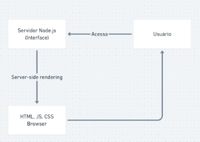
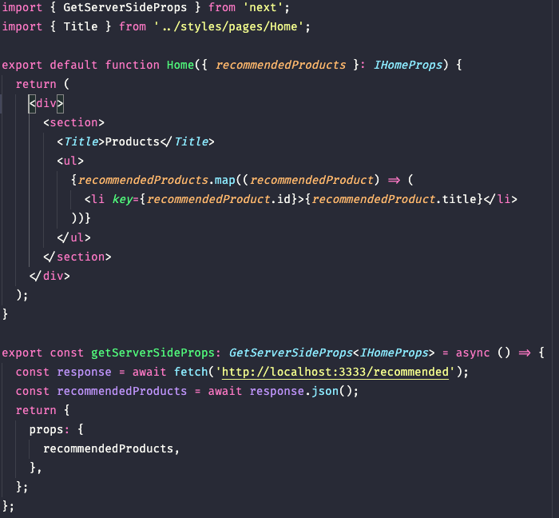

# NextJS

- O que é o NextJS ?

  - NextJS é um framework para desenvolvimento front end web com React.

- O Porque o NextJS é um framework ?

  - O Next adiciona varias funcionaliades em cima do **React** que vão deixar a aplicação React mais preparada para produção.

- No que o NextJS é focado ?

  - Performance e melhorar a indexação

- O que ganhamos utilizando NextJs

  - Utilizando NextJs nós temos o **server side rendering** onde colocamos uma camada a mais com o NodeJs onde ele vai ler nosso código javascript e montar a interface e irá retorna-la após ter carregado todo o HTML, CSS e JS.
    

- O que o Next substitui ?
  - Substitui o Create React APP.
  - Não precisamos mais utilizar React Router Dom para fazer a configurações de rotas em nossa aplicação, basta criar dentro da pasta pages os arquivos de cada página.

## Primeiros passos com NextJS.

<br />
<p> Rode o seguinte comando </p>

```
  yarn create next-app myapp
```

Ou

```
  npx create-next-app myapp
```

Depois

```
  cd myapp && yarn dev
```

<p>Rotas</p>
  
  > Basta criar arquivos dentro da pasta **pages**.
  Caso queira passar algum parametro na url, crie o arquivo no seguinte formato: [id].tsx ou [id].js caso não esteja utilizando typescript

### Diferença entre \_app e \_document

- \_app

  - Componente que fica em volta de todas as páginas e é renderizado apenas uma única vez.

- \_document
  - Component que fica por volta da aplicação mas é renderizado a cada tela. Ele é responsavel por fazer o carregamento de todos os estilos css da nossa aplicação.

### Como fazer requisições http com server side rendering

Crie uma função chamada **getServerSideProps** como mostra a imagem a baixo:

  

> Obs: Não precisamos utilizar essa função para todo tipo de requisição e sim quando a gente precisar acessa uma informação dinamica que precisa estar disponivel para os motores de busca.

### Static site generator

Utilizado parar criar páginas onde não é preciso ter muita atualização de dados que vem de uma API, exemplo a tela de um blog.
